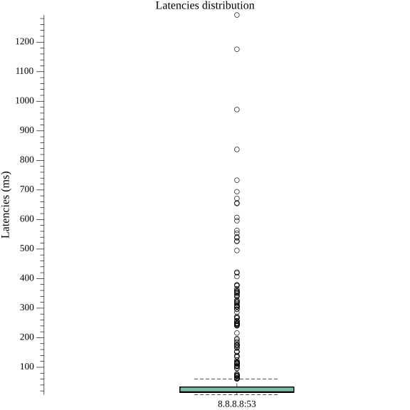
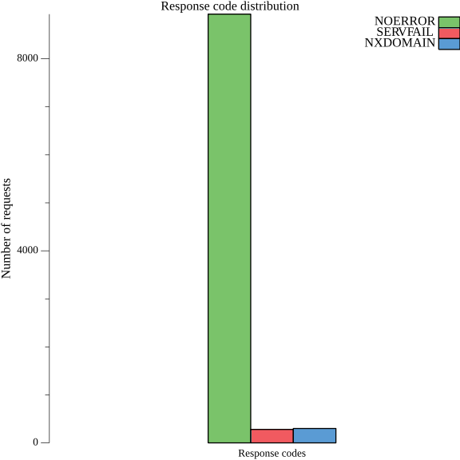
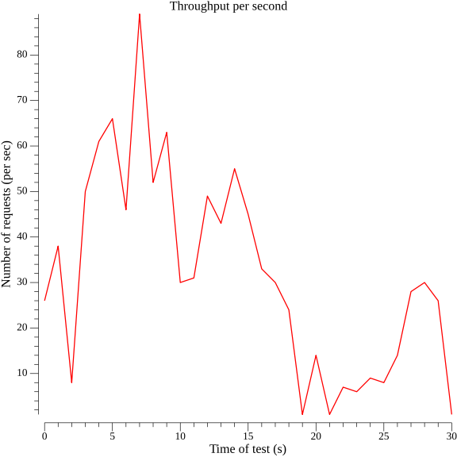
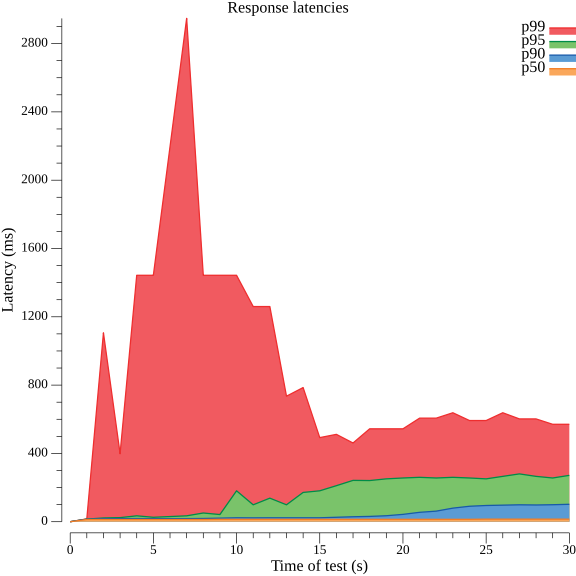

## Examples
+ [parallel benchmark with repeating queries](#parallel-benchmark-with-repeating-queries)
+ [run benchmark over specified time](#run-benchmark-over-specified-time)
+ [sending AAAA DNS queries](#sending-AAAA-DNS-queries)
+ [hostnames provided directly](#multiple-hostnames-provided-directly)
+ [hostnames provided using file](#hostnames-provided-using-file)
+ [hostnames provided using HTTP](#hostnames-provided-using-http)
+ [sending queries of multiple different query types](#sending-queries-of-multiple-different-query-types)
+ [IPv6 DNS server benchmarking](#ipv6-dns-server-benchmarking)
+ [using probability to randomize concurrent queries](#using-probability-to-randomize-concurrent-queries)
+ [EDNSOPT usage](#ednsopt-usage)
+ [DoT](#dot)
  + [DoT with self-signed certificates](#dot-with-self-signed-certificates)
+ [DoH](#doh)
  + [DoH via GET/POST](#doh-via-getpost)
  + [DoH/1.1, DoH/2, DoH/3](#doh/1.1,-doh/2,-doh/3)
  + [DoH via plain HTTP](#doh-via-plain-http)
  + [DoH with self-signed certificates](#doh-with-self-signed-certificates)
+ [Plotting graphs](#plotting-graphs)
+ [Output benchmark results as JSON](#Output-benchmark-results-as-JSON)


### parallel benchmark with repeating queries
this example will execute the benchmark in 10 parallel threads, where each thread will
send 2 `A example.com.` DNS queries serially to the `8.8.8.8` server
```
dnspyre -n 2 -c 10 --server 8.8.8.8 --recurse example.com
```

<details>
<summary>output</summary>

```
Using 1 hostnames
Benchmarking 8.8.8.8:53 via udp with 10 concurrent requests

Total requests:		20
DNS success codes:	20

DNS response codes:
NOERROR:	20

DNS question types:
A:	20

Time taken for tests:	 18.549886ms
Questions per second:	 1078.2
DNS timings, 20 datapoints
min:		 8.126464ms
mean:		 8.801484ms
[+/-sd]:	 371.364µs
max:		 9.961471ms
p99:		 9.961471ms
p95:		 9.437183ms
p90:		 9.437183ms
p75:		 9.437183ms
p50:		 8.912895ms

DNS distribution, 20 datapoints
LATENCY   |                                             | COUNT
+------------+---------------------------------------------+-------+
8.257535ms | ▄▄▄▄▄▄▄▄▄▄▄▄▄                               |     3
8.650751ms | ▄▄▄▄▄▄▄▄▄▄▄▄▄▄▄▄▄▄▄▄▄▄▄▄▄▄▄▄▄▄▄▄▄▄▄▄▄▄▄▄▄▄▄ |    10
9.175039ms | ▄▄▄▄▄▄▄▄▄▄▄▄▄▄▄▄▄▄▄▄▄▄▄▄▄▄                  |     6
9.699327ms | ▄▄▄▄                                        |     1
```

</details>

### run benchmark over specified time
this example will execute the benchmark in 10 parallel threads for a duration of 30 seconds while sending `A example.com` DNS queries
to the `8.8.8.8` server
```
dnspyre --duration 30s -c 10 --server 8.8.8.8 google.com
```

<details>
<summary>output</summary>

```
Using 1 hostnames
Benchmarking 8.8.8.8:53 via udp with 10 concurrent requests

Total requests:		39167
DNS success codes:	39161

DNS response codes:
	NOERROR:	39161
	SERVFAIL:	6

DNS question types:
	A:	39167

Time taken for tests:	 30.007725451s
Questions per second:	 1305.2
DNS timings, 39167 datapoints
	 min:		 6.5536ms
	 mean:		 7.660163ms
	 [+/-sd]:	 730.93µs
	 max:		 20.971519ms
	 p99:		 10.485759ms
	 p95:		 8.912895ms
	 p90:		 8.388607ms
	 p75:		 7.864319ms
	 p50:		 7.602175ms

DNS distribution, 39167 datapoints
    LATENCY   |                                             | COUNT
+-------------+---------------------------------------------+-------+
  6.684671ms  |                                             |    14
  6.946815ms  | ▄▄▄▄▄                                       |  1351
  7.208959ms  | ▄▄▄▄▄▄▄▄▄▄▄▄▄▄▄▄▄▄▄▄▄▄▄▄▄▄▄▄▄▄▄▄▄▄▄▄▄▄▄▄▄▄▄ | 12096
  7.471103ms  | ▄▄▄▄▄▄▄▄▄▄▄▄▄▄▄▄▄▄▄▄▄▄▄▄▄▄▄▄▄▄▄▄▄▄▄▄▄▄▄▄▄   | 11587
  7.733247ms  | ▄▄▄▄▄▄▄▄▄▄▄▄▄▄▄▄▄▄▄▄                        |  5648
  7.995391ms  | ▄▄▄▄▄▄▄▄▄▄▄                                 |  2992
  8.257535ms  | ▄▄▄▄▄▄                                      |  1766
  8.650751ms  | ▄▄▄▄▄▄▄                                     |  1853
  9.175039ms  | ▄▄▄▄                                        |  1029
  9.699327ms  | ▄                                           |   416
  10.223615ms |                                             |   109
  10.747903ms |                                             |    39
  11.272191ms |                                             |    36
  11.796479ms |                                             |    28
  12.320767ms |                                             |    24
  12.845055ms |                                             |    41
  13.369343ms |                                             |    56
  13.893631ms |                                             |    25
  14.417919ms |                                             |     9
  14.942207ms |                                             |    23
  15.466495ms |                                             |     7
  15.990783ms |                                             |     6
  16.515071ms |                                             |     1
  17.301503ms |                                             |     3
  18.350079ms |                                             |     0
  19.398655ms |                                             |     6
  20.447231ms |                                             |     2
```

</details>

### sending AAAA DNS queries
```
dnspyre -n 2 -c 10 --server 8.8.8.8 -t AAAA --recurse example.com
```

<details>
<summary>output</summary>

```
Using 1 hostnames
Benchmarking 8.8.8.8:53 via udp with 10 concurrent requests

Total requests:		20
DNS success codes:	20

DNS response codes:
	NOERROR:	20

DNS question types:
	AAAA:	20

Time taken for tests:	 41.773449ms
Questions per second:	 478.8
DNS timings, 20 datapoints
	 min:		 7.340032ms
	 mean:		 17.308057ms
	 [+/-sd]:	 6.809247ms
	 max:		 27.262975ms
	 p99:		 27.262975ms
	 p95:		 26.214399ms
	 p90:		 26.214399ms
	 p75:		 25.165823ms
	 p50:		 16.252927ms

DNS distribution, 20 datapoints
    LATENCY   |                                             | COUNT
+-------------+---------------------------------------------+-------+
  7.471103ms  | ▄▄▄▄▄▄▄▄▄▄▄▄▄▄                              |     1
  7.733247ms  | ▄▄▄▄▄▄▄▄▄▄▄▄▄▄▄▄▄▄▄▄▄▄▄▄▄▄▄▄▄               |     2
  7.995391ms  | ▄▄▄▄▄▄▄▄▄▄▄▄▄▄                              |     1
  8.257535ms  | ▄▄▄▄▄▄▄▄▄▄▄▄▄▄                              |     1
  8.650751ms  |                                             |     0
  9.175039ms  |                                             |     0
  9.699327ms  |                                             |     0
  10.223615ms |                                             |     0
  10.747903ms |                                             |     0
  11.272191ms |                                             |     0
  11.796479ms |                                             |     0
  12.320767ms |                                             |     0
  12.845055ms |                                             |     0
  13.369343ms |                                             |     0
  13.893631ms |                                             |     0
  14.417919ms |                                             |     0
  14.942207ms | ▄▄▄▄▄▄▄▄▄▄▄▄▄▄                              |     1
  15.466495ms | ▄▄▄▄▄▄▄▄▄▄▄▄▄▄▄▄▄▄▄▄▄▄▄▄▄▄▄▄▄▄▄▄▄▄▄▄▄▄▄▄▄▄▄ |     3
  15.990783ms | ▄▄▄▄▄▄▄▄▄▄▄▄▄▄                              |     1
  16.515071ms |                                             |     0
  17.301503ms | ▄▄▄▄▄▄▄▄▄▄▄▄▄▄▄▄▄▄▄▄▄▄▄▄▄▄▄▄▄▄▄▄▄▄▄▄▄▄▄▄▄▄▄ |     3
  18.350079ms |                                             |     0
  19.398655ms |                                             |     0
  20.447231ms |                                             |     0
  21.495807ms |                                             |     0
  22.544383ms |                                             |     0
  23.592959ms |                                             |     0
  24.641535ms | ▄▄▄▄▄▄▄▄▄▄▄▄▄▄▄▄▄▄▄▄▄▄▄▄▄▄▄▄▄▄▄▄▄▄▄▄▄▄▄▄▄▄▄ |     3
  25.690111ms | ▄▄▄▄▄▄▄▄▄▄▄▄▄▄▄▄▄▄▄▄▄▄▄▄▄▄▄▄▄▄▄▄▄▄▄▄▄▄▄▄▄▄▄ |     3
  26.738687ms | ▄▄▄▄▄▄▄▄▄▄▄▄▄▄                              |     1
```

</details>

### multiple hostnames provided directly
hostnames provided directly as arguments to the tool
```
dnspyre -n 10 -c 10 --server 8.8.8.8 --recurse redsift.io example.com google.com
```

<details>
<summary>output</summary>

```
Using 3 hostnames
Benchmarking 8.8.8.8:53 via udp with 10 concurrent requests

Total requests:		300
DNS success codes:	300

DNS response codes:
	NOERROR:	300

DNS question types:
	A:	300

Time taken for tests:	 393.803502ms
Questions per second:	 761.8
DNS timings, 300 datapoints
	 min:		 7.077888ms
	 mean:		 11.228501ms
	 [+/-sd]:	 14.372965ms
	 max:		 134.217727ms
	 p99:		 109.051903ms
	 p95:		 15.728639ms
	 p90:		 15.728639ms
	 p75:		 8.126463ms
	 p50:		 7.864319ms

DNS distribution, 300 datapoints
    LATENCY    |                                             | COUNT
+--------------+---------------------------------------------+-------+
  7.208959ms   | ▄▄▄▄▄                                       |    12
  7.471103ms   | ▄▄▄▄▄▄▄▄▄▄▄▄▄▄▄▄▄▄▄▄▄▄▄▄▄▄▄▄▄▄▄▄▄▄▄▄▄▄▄▄▄▄▄ |   111
  7.733247ms   | ▄▄▄▄▄▄▄▄▄▄▄▄▄▄▄▄▄▄▄▄▄▄▄▄▄▄▄▄▄▄▄▄▄▄          |    89
  7.995391ms   | ▄▄▄▄▄▄▄▄▄▄                                  |    25
  8.257535ms   | ▄                                           |     3
  8.650751ms   |                                             |     0
  9.175039ms   | ▄                                           |     2
  9.699327ms   |                                             |     0
  10.223615ms  |                                             |     0
  10.747903ms  |                                             |     0
  11.272191ms  |                                             |     0
  11.796479ms  |                                             |     0
  12.320767ms  |                                             |     0
  12.845055ms  |                                             |     0
  13.369343ms  |                                             |     0
  13.893631ms  |                                             |     0
  14.417919ms  |                                             |     0
  14.942207ms  | ▄▄▄▄▄▄▄▄▄                                   |    23
  15.466495ms  | ▄▄▄▄▄▄▄▄▄                                   |    24
  15.990783ms  |                                             |     1
  16.515071ms  |                                             |     0
  17.301503ms  |                                             |     0
  18.350079ms  |                                             |     0
  19.398655ms  |                                             |     0
  20.447231ms  |                                             |     0
  21.495807ms  |                                             |     0
  22.544383ms  |                                             |     0
  23.592959ms  |                                             |     0
  24.641535ms  |                                             |     0
  25.690111ms  |                                             |     0
  26.738687ms  |                                             |     0
  27.787263ms  |                                             |     0
  28.835839ms  |                                             |     0
  29.884415ms  |                                             |     0
  30.932991ms  |                                             |     0
  31.981567ms  |                                             |     0
  33.030143ms  |                                             |     0
  34.603007ms  |                                             |     0
  36.700159ms  |                                             |     0
  38.797311ms  |                                             |     0
  40.894463ms  |                                             |     0
  42.991615ms  |                                             |     0
  45.088767ms  |                                             |     0
  47.185919ms  |                                             |     0
  49.283071ms  |                                             |     1
  51.380223ms  | ▄▄                                          |     4
  53.477375ms  |                                             |     1
  55.574527ms  |                                             |     0
  57.671679ms  |                                             |     0
  59.768831ms  |                                             |     0
  61.865983ms  |                                             |     0
  63.963135ms  |                                             |     0
  66.060287ms  |                                             |     0
  69.206015ms  |                                             |     0
  73.400319ms  |                                             |     0
  77.594623ms  |                                             |     0
  81.788927ms  |                                             |     0
  85.983231ms  |                                             |     0
  90.177535ms  |                                             |     0
  94.371839ms  |                                             |     0
  98.566143ms  |                                             |     0
  102.760447ms |                                             |     0
  106.954751ms |                                             |     1
  111.149055ms |                                             |     1
  115.343359ms |                                             |     0
  119.537663ms |                                             |     0
  123.731967ms |                                             |     0
  127.926271ms |                                             |     0
  132.120575ms | ▄                                           |     2
```

</details>

### hostnames provided using file
loads hostnames from given data source file
```
dnspyre -n 10 -c 10 --server 8.8.8.8 --recurse @data/2-domains
```

<details>
<summary>output</summary>

```
Using 2 hostnames
Benchmarking 8.8.8.8:53 via udp with 10 concurrent requests

Total requests:		200
DNS success codes:	200

DNS response codes:
	NOERROR:	200

DNS question types:
	A:	200

Time taken for tests:	 174.521732ms
Questions per second:	 1146.0
DNS timings, 200 datapoints
	 min:		 7.077888ms
	 mean:		 7.963279ms
	 [+/-sd]:	 1.351917ms
	 max:		 17.825791ms
	 p99:		 15.728639ms
	 p95:		 9.961471ms
	 p90:		 8.912895ms
	 p75:		 7.864319ms
	 p50:		 7.864319ms

DNS distribution, 200 datapoints
    LATENCY   |                                             | COUNT
+-------------+---------------------------------------------+-------+
  7.208959ms  | ▄▄▄▄▄▄▄▄▄▄                                  |    18
  7.471103ms  | ▄▄▄▄▄▄▄▄▄▄▄▄▄▄▄▄▄▄▄▄▄▄▄▄▄▄▄▄▄▄▄▄▄▄▄▄▄▄▄▄▄▄▄ |    77
  7.733247ms  | ▄▄▄▄▄▄▄▄▄▄▄▄▄▄▄▄▄▄▄▄▄▄▄▄▄▄▄▄▄▄▄▄▄           |    59
  7.995391ms  | ▄▄▄▄▄▄▄▄▄                                   |    16
  8.257535ms  | ▄▄▄                                         |     5
  8.650751ms  | ▄▄▄▄                                        |     7
  9.175039ms  | ▄▄▄▄                                        |     7
  9.699327ms  | ▄▄                                          |     4
  10.223615ms | ▄                                           |     2
  10.747903ms |                                             |     0
  11.272191ms |                                             |     0
  11.796479ms |                                             |     0
  12.320767ms |                                             |     0
  12.845055ms |                                             |     0
  13.369343ms |                                             |     0
  13.893631ms |                                             |     0
  14.417919ms |                                             |     0
  14.942207ms | ▄                                           |     2
  15.466495ms | ▄                                           |     2
  15.990783ms |                                             |     0
  16.515071ms |                                             |     0
  17.301503ms | ▄                                           |     1
```

</details>

### hostnames provided using HTTP
```
dnspyre -n 10 -c 10 --server 8.8.8.8 --recurse https://raw.githubusercontent.com/Tantalor93/dnspyre/master/data/2-domains
```

<details>
<summary>output</summary>

```
Using 2 hostnames
Benchmarking 8.8.8.8:53 via udp with 10 concurrent requests

Total requests:		200
DNS success codes:	200

DNS response codes:
	NOERROR:	200

DNS question types:
	A:	200

Time taken for tests:	 252.896874ms
Questions per second:	 790.8
DNS timings, 200 datapoints
	 min:		 7.077888ms
	 mean:		 9.133752ms
	 [+/-sd]:	 3.006855ms
	 max:		 17.825791ms
	 p99:		 16.777215ms
	 p95:		 16.252927ms
	 p90:		 15.728639ms
	 p75:		 8.388607ms
	 p50:		 7.864319ms

DNS distribution, 200 datapoints
    LATENCY   |                                             | COUNT
+-------------+---------------------------------------------+-------+
  7.208959ms  | ▄▄▄▄▄▄▄▄▄▄▄▄▄                               |    14
  7.471103ms  | ▄▄▄▄▄▄▄▄▄▄▄▄▄▄▄▄▄▄▄▄▄▄▄▄▄▄▄▄▄▄▄▄▄▄▄▄▄       |    40
  7.733247ms  | ▄▄▄▄▄▄▄▄▄▄▄▄▄▄▄▄▄▄▄▄▄▄▄▄▄▄▄▄▄▄▄▄▄▄▄▄▄▄▄▄▄▄▄ |    47
  7.995391ms  | ▄▄▄▄▄▄▄▄▄▄▄▄▄▄▄▄▄▄▄▄▄▄▄▄▄▄▄▄▄▄▄▄▄▄▄▄▄▄▄▄▄   |    45
  8.257535ms  | ▄▄▄▄▄▄▄▄▄▄                                  |    11
  8.650751ms  | ▄▄▄▄▄▄▄                                     |     8
  9.175039ms  | ▄                                           |     1
  9.699327ms  |                                             |     0
  10.223615ms |                                             |     0
  10.747903ms |                                             |     0
  11.272191ms |                                             |     0
  11.796479ms |                                             |     0
  12.320767ms |                                             |     0
  12.845055ms |                                             |     0
  13.369343ms |                                             |     0
  13.893631ms |                                             |     0
  14.417919ms |                                             |     0
  14.942207ms | ▄▄▄▄                                        |     4
  15.466495ms | ▄▄▄▄▄▄▄▄▄▄▄▄▄▄▄▄                            |    17
  15.990783ms | ▄▄▄▄▄▄                                      |     7
  16.515071ms | ▄▄▄▄▄                                       |     5
  17.301503ms | ▄                                           |     1
```

</details>

### sending queries of multiple different query types
this can be achieved by repeating type `-t`, all queries will be made by each specified query type
```
dnspyre -n 10 -c 10 --server 8.8.8.8 --recurse -t A -t AAAA @data/2-domains
```
together with probability option this can be used for generating arbitrary random load
```
dnspyre -n 10 -c 10 --server 8.8.8.8 --recurse -t A -t AAAA @data/2-domains --probability 0.33
```

<details>
<summary>output</summary>

```
Using 2 hostnames
Benchmarking 8.8.8.8:53 via udp with 10 concurrent requests

Total requests:		190
DNS success codes:	190

DNS response codes:
	NOERROR:	190

DNS question types:
	A:	90
	AAAA:	100

Time taken for tests:	 193.536282ms
Questions per second:	 981.7
DNS timings, 190 datapoints
	 min:		 7.077888ms
	 mean:		 8.972913ms
	 [+/-sd]:	 2.700899ms
	 max:		 16.252927ms
	 p99:		 16.252927ms
	 p95:		 15.728639ms
	 p90:		 15.728639ms
	 p75:		 8.388607ms
	 p50:		 7.864319ms

DNS distribution, 190 datapoints
    LATENCY   |                                             | COUNT
+-------------+---------------------------------------------+-------+
  7.208959ms  | ▄▄▄▄▄▄▄▄▄▄▄                                 |    12
  7.471103ms  | ▄▄▄▄▄▄▄▄▄▄▄▄▄▄▄▄▄▄▄▄▄▄▄▄▄▄▄▄▄▄▄▄▄           |    36
  7.733247ms  | ▄▄▄▄▄▄▄▄▄▄▄▄▄▄▄▄▄▄▄▄▄▄▄▄▄▄▄▄▄▄▄▄▄▄▄▄▄▄▄▄▄▄▄ |    47
  7.995391ms  | ▄▄▄▄▄▄▄▄▄▄▄▄▄▄▄▄▄▄▄▄▄▄▄▄▄▄▄▄▄▄▄▄            |    35
  8.257535ms  | ▄▄▄▄▄▄▄▄▄▄▄▄▄▄                              |    15
  8.650751ms  | ▄▄▄▄▄▄▄▄▄▄                                  |    11
  9.175039ms  | ▄▄▄▄▄                                       |     5
  9.699327ms  |                                             |     0
  10.223615ms |                                             |     0
  10.747903ms | ▄                                           |     1
  11.272191ms |                                             |     0
  11.796479ms |                                             |     0
  12.320767ms |                                             |     0
  12.845055ms |                                             |     0
  13.369343ms |                                             |     0
  13.893631ms |                                             |     0
  14.417919ms |                                             |     0
  14.942207ms | ▄▄▄▄▄▄▄                                     |     8
  15.466495ms | ▄▄▄▄▄▄▄▄▄▄▄▄▄▄▄▄                            |    17
  15.990783ms | ▄▄▄                                         |     3
```

</details>

### IPv6 DNS server benchmarking
note the brackets format
```
dnspyre -n 10 -c 10 --server '[fddd:dddd::]:53' --recurse idnes.cz
```

or 

```
dnspyre -n 10 -c 10 --server 'fddd:dddd::' --recurse idnes.cz
```

<details>
<summary>output</summary>

```
Using 1 hostnames
Benchmarking [fddd:dddd::]:53 via udp with 10 concurrent requests

Total requests:		100
DNS success codes:	100

DNS response codes:
	NOERROR:	100

DNS question types:
	A:	100

Time taken for tests:	 500.845278ms
Questions per second:	 199.7
DNS timings, 100 datapoints
	 min:		 46.137344ms
	 mean:		 49.786388ms
	 [+/-sd]:	 2.501156ms
	 max:		 58.720255ms
	 p99:		 58.720255ms
	 p95:		 56.623103ms
	 p90:		 54.525951ms
	 p75:		 50.331647ms
	 p50:		 50.331647ms

DNS distribution, 100 datapoints
    LATENCY   |                                             | COUNT
+-------------+---------------------------------------------+-------+
  47.185919ms | ▄▄▄▄▄▄▄▄▄▄▄▄▄                               |    19
  49.283071ms | ▄▄▄▄▄▄▄▄▄▄▄▄▄▄▄▄▄▄▄▄▄▄▄▄▄▄▄▄▄▄▄▄▄▄▄▄▄▄▄▄▄▄▄ |    63
  51.380223ms | ▄▄▄▄▄                                       |     7
  53.477375ms | ▄                                           |     1
  55.574527ms | ▄▄▄▄                                        |     6
  57.671679ms | ▄▄▄                                         |     4
```

</details>


### using probability to randomize concurrent queries
you can randomize queries fired by each concurrent thread by using probability lesser than 1, in this example
roughly every third hostname from datasource will be used by the single concurrent benchmark thread
```
dnspyre -c 10 --server 8.8.8.8  --recurse --probability 0.33  @data/alexa
```

<details>
<summary>output</summary>

```
Using 33575 hostnames
Benchmarking 8.8.8.8:53 via udp with 10 concurrent requests

Total requests:		40223
Read/Write errors:	119
DNS success codes:	33602
Truncated responses:	10

DNS response codes:
	NOERROR:	33602
	SERVFAIL:	343
	NXDOMAIN:	6159

DNS question types:
	A:	40104

Time taken for tests:	 5m53.670707072s
Questions per second:	 113.7
DNS timings, 40104 datapoints
	 min:		 6.815744ms
	 mean:		 76.295153ms
	 [+/-sd]:	 199.146195ms
	 max:		 4.026531839s
	 p99:		 738.197503ms
	 p95:		 318.767103ms
	 p90:		 251.658239ms
	 p75:		 29.360127ms
	 p50:		 15.728639ms

DNS distribution, 40104 datapoints
    LATENCY    |                                             | COUNT
+--------------+---------------------------------------------+-------+
  6.946815ms   |                                             |    51
  7.208959ms   | ▄▄                                          |   400
  7.471103ms   | ▄▄▄                                         |   840
  7.733247ms   | ▄▄▄                                         |   628
  7.995391ms   | ▄                                           |   228
  8.257535ms   |                                             |    67
  8.650751ms   |                                             |    31
  9.175039ms   |                                             |     7
  9.699327ms   |                                             |     8
  10.223615ms  |                                             |     2
  10.747903ms  |                                             |     1
  11.272191ms  |                                             |     8
  11.796479ms  |                                             |     4
  12.320767ms  |                                             |     1
  12.845055ms  |                                             |     5
  13.369343ms  |                                             |     5
  13.893631ms  |                                             |     0
  14.417919ms  | ▄                                           |   332
  14.942207ms  | ▄▄▄▄▄▄▄▄▄▄▄▄▄▄▄▄▄▄▄▄▄▄▄▄▄▄▄▄▄▄▄▄▄▄▄▄▄▄▄▄▄▄▄ | 10536
  15.466495ms  | ▄▄▄▄▄▄▄▄▄▄▄▄▄▄▄▄▄▄▄▄▄▄▄▄▄▄▄▄▄▄▄▄▄▄▄         |  8562
  15.990783ms  | ▄▄▄▄▄▄                                      |  1381
  16.515071ms  | ▄▄▄                                         |   686
  17.301503ms  | ▄▄▄▄▄▄▄                                     |  1732
  18.350079ms  | ▄▄▄▄                                        |   979
  19.398655ms  | ▄▄▄                                         |   792
  20.447231ms  | ▄▄                                          |   468
  21.495807ms  | ▄                                           |   264
  22.544383ms  | ▄                                           |   257
  23.592959ms  | ▄▄                                          |   472
  24.641535ms  | ▄                                           |   330
  25.690111ms  | ▄▄                                          |   390
  26.738687ms  | ▄                                           |   297
  27.787263ms  | ▄                                           |   255
  28.835839ms  | ▄                                           |   190
  29.884415ms  | ▄                                           |   188
  30.932991ms  | ▄                                           |   175
  31.981567ms  | ▄                                           |   159
  33.030143ms  |                                             |   104
  34.603007ms  | ▄                                           |   189
  36.700159ms  | ▄                                           |   211
  38.797311ms  |                                             |   113
  40.894463ms  | ▄                                           |   132
  42.991615ms  | ▄                                           |   137
  45.088767ms  | ▄                                           |   130
  47.185919ms  |                                             |    88
  49.283071ms  |                                             |    83
  51.380223ms  |                                             |    75
  53.477375ms  |                                             |    45
  55.574527ms  |                                             |    31
  57.671679ms  |                                             |    45
  59.768831ms  | ▄                                           |   126
  61.865983ms  | ▄                                           |   146
  63.963135ms  |                                             |    72
  66.060287ms  |                                             |    35
  69.206015ms  |                                             |    83
  73.400319ms  |                                             |    31
  77.594623ms  |                                             |    14
  81.788927ms  |                                             |    14
  85.983231ms  |                                             |    13
  90.177535ms  |                                             |    18
  94.371839ms  |                                             |    33
  98.566143ms  | ▄                                           |   177
  102.760447ms | ▄                                           |   244
  106.954751ms |                                             |   115
  111.149055ms |                                             |    93
  115.343359ms |                                             |   115
  119.537663ms |                                             |   108
  123.731967ms |                                             |    60
  127.926271ms |                                             |    58
  132.120575ms |                                             |    45
  138.412031ms | ▄                                           |   138
  146.800639ms | ▄                                           |   157
  155.189247ms |                                             |    93
  163.577855ms | ▄▄                                          |   396
  171.966463ms | ▄                                           |   203
  180.355071ms | ▄                                           |   167
  188.743679ms |                                             |    57
  197.132287ms |                                             |    56
  205.520895ms |                                             |    30
  213.909503ms | ▄                                           |   307
  222.298111ms |                                             |    86
  230.686719ms |                                             |    85
  239.075327ms | ▄                                           |   301
  247.463935ms | ▄▄▄▄                                        |   904
  255.852543ms | ▄▄                                          |   436
  264.241151ms | ▄                                           |   198
  276.824063ms | ▄                                           |   309
  293.601279ms | ▄                                           |   219
  310.378495ms | ▄                                           |   362
  327.155711ms | ▄                                           |   272
  343.932927ms | ▄                                           |   234
  360.710143ms | ▄                                           |   140
  377.487359ms |                                             |    39
  394.264575ms |                                             |    77
  411.041791ms |                                             |    51
  427.819007ms |                                             |    23
  444.596223ms |                                             |    15
  461.373439ms |                                             |    22
  478.150655ms |                                             |    55
  494.927871ms |                                             |    57
  511.705087ms |                                             |    38
  528.482303ms |                                             |    44
  553.648127ms |                                             |   107
  587.202559ms |                                             |    78
  620.756991ms |                                             |   102
  654.311423ms |                                             |    61
  687.865855ms |                                             |    64
  721.420287ms |                                             |    38
  754.974719ms |                                             |    18
  788.529151ms |                                             |     9
  822.083583ms |                                             |    11
  855.638015ms |                                             |     5
  889.192447ms |                                             |     3
  922.746879ms |                                             |     8
  956.301311ms |                                             |    15
  989.855743ms |                                             |     3
  1.023410175s |                                             |    11
  1.056964607s |                                             |    10
  1.107296255s |                                             |    12
  1.174405119s |                                             |     4
  1.241513983s |                                             |    10
  1.308622847s |                                             |    11
  1.375731711s |                                             |    11
  1.442840575s |                                             |     5
  1.509949439s |                                             |     8
  1.577058303s |                                             |     7
  1.644167167s |                                             |    11
  1.711276031s |                                             |    15
  1.778384895s |                                             |     9
  1.845493759s |                                             |     8
  1.912602623s |                                             |     0
  1.979711487s |                                             |     0
  2.046820351s |                                             |    70
  2.113929215s |                                             |    30
  2.214592511s |                                             |    28
  2.348810239s |                                             |     1
  2.483027967s |                                             |     6
  2.617245695s |                                             |     8
  2.751463423s |                                             |     3
  2.885681151s |                                             |     9
  3.019898879s |                                             |     2
  3.154116607s |                                             |     1
  3.288334335s |                                             |     0
  3.422552063s |                                             |     3
  3.556769791s |                                             |     0
  3.690987519s |                                             |     0
  3.825205247s |                                             |     2
  3.959422975s |                                             |     2
```

</details>

### EDNSOPT usage
you can also specify EDNS option with arbitrary payload, here we are specifying EDNSOPT `65518`
coming from the local/experimental range with payload `fddddddd100000000000000000000001`
```
dnspyre -n 10 -c 10  --recurse idnes.cz --server 127.0.0.1 --ednsopt=65518:fddddddd100000000000000000000001
```

### DoT
benchmarking DoT server
```
dnspyre -n 10 -c 10  --dot --recurse  --server 1.1.1.1:853 idnes.cz
```

<details>
<summary>output</summary>

```
Using 1 hostnames
Benchmarking 1.1.1.1:853 via tcp with 10 concurrent requests

Total requests:		100
DNS success codes:	100

DNS response codes:
	NOERROR:	100

DNS question types:
	A:	100

Time taken for tests:	 276.879038ms
Questions per second:	 361.2
DNS timings, 100 datapoints
	 min:		 7.077888ms
	 mean:		 27.150254ms
	 [+/-sd]:	 55.581566ms
	 max:		 201.326591ms
	 p99:		 201.326591ms
	 p95:		 201.326591ms
	 p90:		 14.155775ms
	 p75:		 9.437183ms
	 p50:		 8.912895ms

DNS distribution, 100 datapoints
    LATENCY    |                                             | COUNT
+--------------+---------------------------------------------+-------+
  7.208959ms   | ▄▄▄▄▄                                       |     2
  7.471103ms   | ▄▄▄▄▄▄▄▄▄▄▄▄▄▄▄▄▄▄▄▄▄▄▄▄▄▄▄                 |    12
  7.733247ms   | ▄▄▄▄▄▄▄▄▄▄▄▄▄▄▄▄▄▄▄▄▄▄▄▄▄                   |    11
  7.995391ms   | ▄▄▄▄▄▄▄▄▄▄▄▄▄▄▄▄▄▄▄▄▄▄▄▄▄▄▄▄▄               |    13
  8.257535ms   | ▄▄▄▄▄▄▄▄▄▄▄▄▄▄                              |     6
  8.650751ms   | ▄▄▄▄▄▄▄▄▄▄▄▄▄▄▄▄▄▄▄▄▄▄▄▄▄▄▄▄▄▄▄▄▄▄▄▄▄▄▄▄▄▄▄ |    19
  9.175039ms   | ▄▄▄▄▄▄▄▄▄▄▄▄▄▄▄▄▄▄▄▄▄▄▄▄▄▄▄▄▄               |    13
  9.699327ms   | ▄▄▄▄▄▄▄▄▄▄▄                                 |     5
  10.223615ms  | ▄▄▄▄▄▄▄                                     |     3
  10.747903ms  | ▄▄                                          |     1
  11.272191ms  | ▄▄▄▄▄▄▄                                     |     3
  11.796479ms  |                                             |     0
  12.320767ms  |                                             |     0
  12.845055ms  |                                             |     0
  13.369343ms  | ▄▄                                          |     1
  13.893631ms  | ▄▄                                          |     1
  14.417919ms  |                                             |     0
  14.942207ms  |                                             |     0
  15.466495ms  |                                             |     0
  15.990783ms  |                                             |     0
  16.515071ms  |                                             |     0
  17.301503ms  |                                             |     0
  18.350079ms  |                                             |     0
  19.398655ms  |                                             |     0
  20.447231ms  |                                             |     0
  21.495807ms  |                                             |     0
  22.544383ms  |                                             |     0
  23.592959ms  |                                             |     0
  24.641535ms  |                                             |     0
  25.690111ms  |                                             |     0
  26.738687ms  |                                             |     0
  27.787263ms  |                                             |     0
  28.835839ms  |                                             |     0
  29.884415ms  |                                             |     0
  30.932991ms  |                                             |     0
  31.981567ms  |                                             |     0
  33.030143ms  |                                             |     0
  34.603007ms  |                                             |     0
  36.700159ms  |                                             |     0
  38.797311ms  |                                             |     0
  40.894463ms  |                                             |     0
  42.991615ms  |                                             |     0
  45.088767ms  |                                             |     0
  47.185919ms  |                                             |     0
  49.283071ms  |                                             |     0
  51.380223ms  |                                             |     0
  53.477375ms  |                                             |     0
  55.574527ms  |                                             |     0
  57.671679ms  |                                             |     0
  59.768831ms  |                                             |     0
  61.865983ms  |                                             |     0
  63.963135ms  |                                             |     0
  66.060287ms  |                                             |     0
  69.206015ms  |                                             |     0
  73.400319ms  |                                             |     0
  77.594623ms  |                                             |     0
  81.788927ms  |                                             |     0
  85.983231ms  |                                             |     0
  90.177535ms  |                                             |     0
  94.371839ms  |                                             |     0
  98.566143ms  |                                             |     0
  102.760447ms |                                             |     0
  106.954751ms |                                             |     0
  111.149055ms |                                             |     0
  115.343359ms |                                             |     0
  119.537663ms |                                             |     0
  123.731967ms |                                             |     0
  127.926271ms |                                             |     0
  132.120575ms |                                             |     0
  138.412031ms |                                             |     0
  146.800639ms |                                             |     0
  155.189247ms |                                             |     0
  163.577855ms |                                             |     0
  171.966463ms |                                             |     0
  180.355071ms | ▄▄                                          |     1
  188.743679ms | ▄▄▄▄▄                                       |     2
  197.132287ms | ▄▄▄▄▄▄▄▄▄▄▄▄▄▄▄▄                            |     7
```

</details>

#### DoT with self-signed certificates
In some cases you might want to skip invalid and self-signed certificates, this can be achieved by using `--insecure` argument

```
dnspyre --server 127.0.0.1:5553 --dot --insecure google.com
```

### DoH
benchmarking DoH server via DoH over POST method
```
dnspyre -n 200 -c 2 --server 'https://1.1.1.1/dns-query' --recurse google.com
```

<details>
<summary>output</summary>

```
Using 1 hostnames
Benchmarking https://1.1.1.1/dns-query via https/1.1 (POST) with 2 concurrent requests

Total requests:		400
DNS success codes:	400

DNS response codes:
	NOERROR:	400

DNS question types:
	A:	400

Time taken for tests:	 2.147329978s
Questions per second:	 186.3
DNS timings, 400 datapoints
	 min:		 7.077888ms
	 mean:		 10.615848ms
	 [+/-sd]:	 4.22825ms
	 max:		 56.623103ms
	 p99:		 25.165823ms
	 p95:		 15.204351ms
	 p90:		 13.631487ms
	 p75:		 11.534335ms
	 p50:		 9.961471ms

DNS distribution, 400 datapoints
    LATENCY   |                                             | COUNT
+-------------+---------------------------------------------+-------+
  7.208959ms  | ▄                                           |     2
  7.471103ms  | ▄                                           |     1
  7.733247ms  | ▄▄▄▄▄                                       |     8
  7.995391ms  | ▄▄▄▄▄▄▄▄                                    |    14
  8.257535ms  | ▄▄▄▄▄▄▄▄▄▄▄▄▄▄▄▄▄▄                          |    30
  8.650751ms  | ▄▄▄▄▄▄▄▄▄▄▄▄▄▄▄▄▄▄▄▄▄▄▄▄▄▄▄▄▄▄▄▄▄▄▄▄▄▄▄▄▄▄▄ |    73
  9.175039ms  | ▄▄▄▄▄▄▄▄▄▄▄▄▄▄▄▄▄▄▄▄▄▄▄▄▄▄▄▄▄▄▄▄▄▄▄▄▄▄▄▄▄▄  |    71
  9.699327ms  | ▄▄▄▄▄▄▄▄▄▄▄▄▄▄▄▄                            |    28
  10.223615ms | ▄▄▄▄▄▄▄▄▄▄▄▄▄▄▄▄▄▄▄▄▄                       |    36
  10.747903ms | ▄▄▄▄▄▄▄▄▄▄▄                                 |    18
  11.272191ms | ▄▄▄▄▄▄▄▄▄▄▄▄▄▄▄▄▄▄▄                         |    33
  11.796479ms | ▄▄▄▄▄▄▄▄▄▄▄▄                                |    21
  12.320767ms | ▄▄▄▄▄▄▄                                     |    12
  12.845055ms | ▄▄▄▄▄▄                                      |    10
  13.369343ms | ▄▄▄▄▄                                       |     8
  13.893631ms | ▄▄                                          |     3
  14.417919ms | ▄▄▄▄                                        |     7
  14.942207ms | ▄▄▄                                         |     5
  15.466495ms | ▄                                           |     1
  15.990783ms | ▄                                           |     2
  16.515071ms | ▄▄▄                                         |     5
  17.301503ms | ▄                                           |     2
  18.350079ms |                                             |     0
  19.398655ms | ▄                                           |     1
  20.447231ms | ▄                                           |     1
  21.495807ms |                                             |     0
  22.544383ms | ▄▄                                          |     3
  23.592959ms |                                             |     0
  24.641535ms | ▄                                           |     1
  25.690111ms | ▄                                           |     1
  26.738687ms |                                             |     0
  27.787263ms |                                             |     0
  28.835839ms |                                             |     0
  29.884415ms |                                             |     0
  30.932991ms |                                             |     0
  31.981567ms |                                             |     0
  33.030143ms | ▄                                           |     1
  34.603007ms |                                             |     0
  36.700159ms |                                             |     0
  38.797311ms |                                             |     0
  40.894463ms |                                             |     0
  42.991615ms |                                             |     0
  45.088767ms |                                             |     0
  47.185919ms |                                             |     0
  49.283071ms |                                             |     0
  51.380223ms |                                             |     0
  53.477375ms |                                             |     0
  55.574527ms | ▄                                           |     2
```

</details>

#### DoH via GET/POST
you can also specify whether the DoH is done via GET or POST using `--doh-method`
```
dnspyre -c 2 --server 'https://1.1.1.1/dns-query' --doh-method get --recurse google.com
```

<details>
<summary>output</summary>

```
Using 1 hostnames
Benchmarking https://1.1.1.1/dns-query via https/1.1 (GET) with 2 concurrent requests

Total requests:		2
DNS success codes:	2

DNS response codes:
	NOERROR:	2

DNS question types:
	A:	2

Time taken for tests:	 41.29348ms
Questions per second:	 48.4
DNS timings, 2 datapoints
	 min:		 39.845888ms
	 mean:		 40.894464ms
	 [+/-sd]:	 0s
	 max:		 41.943039ms
	 p99:		 41.943039ms
	 p95:		 41.943039ms
	 p90:		 41.943039ms
	 p75:		 41.943039ms
	 p50:		 41.943039ms

DNS distribution, 2 datapoints
    LATENCY   |                                             | COUNT
+-------------+---------------------------------------------+-------+
  40.894463ms | ▄▄▄▄▄▄▄▄▄▄▄▄▄▄▄▄▄▄▄▄▄▄▄▄▄▄▄▄▄▄▄▄▄▄▄▄▄▄▄▄▄▄▄ |     2
```

</details>

#### DoH/1.1, DoH/2, DoH/3
you can also specify whether the DoH is done over HTTP/1.1, HTTP/2, HTTP/3 using `--doh-protocol`, for example:
```
dnspyre -c 2 --server 'https://1.1.1.1/dns-query' --doh-protocol 2 --recurse google.com
```

<details>
<summary>output</summary>

```
Using 1 hostnames
Benchmarking https://1.1.1.1/dns-query via https/2 (POST) with 2 concurrent requests

Total requests:		2
DNS success codes:	2

DNS response codes:
	NOERROR:	2

DNS question types:
	A:	2

Time taken for tests:	 73.248599ms
Questions per second:	 27.3
DNS timings, 2 datapoints
	 min:		 65.011712ms
	 mean:		 69.730304ms
	 [+/-sd]:	 3.670016ms
	 max:		 75.497471ms
	 p99:		 75.497471ms
	 p95:		 75.497471ms
	 p90:		 75.497471ms
	 p75:		 75.497471ms
	 p50:		 67.108863ms

DNS distribution, 2 datapoints
    LATENCY   |                                             | COUNT
+-------------+---------------------------------------------+-------+
  66.060287ms | ▄▄▄▄▄▄▄▄▄▄▄▄▄▄▄▄▄▄▄▄▄▄▄▄▄▄▄▄▄▄▄▄▄▄▄▄▄▄▄▄▄▄▄ |     1
  69.206015ms |                                             |     0
  73.400319ms | ▄▄▄▄▄▄▄▄▄▄▄▄▄▄▄▄▄▄▄▄▄▄▄▄▄▄▄▄▄▄▄▄▄▄▄▄▄▄▄▄▄▄▄ |     1
```

</details>

#### DoH via plain HTTP
even plain HTTP without TLS can be used as transport for DoH requests, this is configured based on server URL containing either `https://` or `http://`
```
dnspyre --server http://127.0.0.1/dns-query google.com
```

<details>
<summary>output</summary>

```
Using 1 hostnames
Benchmarking http://127.0.0.1/dns-query via http/1.1 (POST) with 1 concurrent requests

Total requests:		1
DNS success codes:	1

DNS response codes:
	NOERROR:	1

DNS question types:
	A:	1

Time taken for tests:	 75.145149ms
Questions per second:	 13.3
DNS timings, 1 datapoints
	 min:		 71.303168ms
	 mean:		 73.40032ms
	 [+/-sd]:	 0s
	 max:		 75.497471ms
	 p99:		 75.497471ms
	 p95:		 75.497471ms
	 p90:		 75.497471ms
	 p75:		 75.497471ms
	 p50:		 75.497471ms
```
</details>

#### DoH with self-signed certificates
In some cases you might want to skip invalid and self-signed certificates, this can be achieved by using `--insecure` argument

```
dnspyre --server https://127.0.0.1/dns-query  --insecure google.com
```


### Plotting graphs
plots benchmark results as histograms, boxplots and line graphs to the new subdirectory `graphs-<RFC3339 timestamp>` in the current directory
```
dnspyre -d 30s -c 2 --server 8.8.8.8 --plot . --recurse https://raw.githubusercontent.com/Tantalor93/dnspyre/master/data/1000-domains
```

<details>
<summary>output</summary>

```
Using 1000 hostnames
Benchmarking 8.8.8.8:53 via udp with 2 concurrent requests

Total requests:		1519
DNS success codes:	1465

DNS response codes:
	NOERROR:	1465
	SERVFAIL:	12
	NXDOMAIN:	42

DNS question types:
	A:	1519

Time taken for tests:	 30.070961943s
Questions per second:	 50.5
DNS timings, 1519 datapoints
	 min:		 6.815744ms
	 mean:		 39.553543ms
	 [+/-sd]:	 87.640787ms
	 max:		 1.140850687s
	 p99:		 419.430399ms
	 p95:		 251.658239ms
	 p90:		 37.748735ms
	 p75:		 18.874367ms
	 p50:		 15.728639ms

DNS distribution, 1519 datapoints
    LATENCY    |                                             | COUNT
+--------------+---------------------------------------------+-------+
  6.946815ms   |                                             |     4
  7.208959ms   | ▄                                           |    16
  7.471103ms   | ▄▄▄▄                                        |    47
  7.733247ms   | ▄▄▄                                         |    32
  7.995391ms   | ▄                                           |     7
  8.257535ms   |                                             |     4
  8.650751ms   |                                             |     1
  9.175039ms   |                                             |     1
  9.699327ms   |                                             |     0
  10.223615ms  |                                             |     0
  10.747903ms  |                                             |     0
  11.272191ms  |                                             |     0
  11.796479ms  |                                             |     0
  12.320767ms  |                                             |     0
  12.845055ms  |                                             |     0
  13.369343ms  |                                             |     0
  13.893631ms  |                                             |     0
  14.417919ms  | ▄                                           |    13
  14.942207ms  | ▄▄▄▄▄▄▄▄▄▄▄▄▄▄▄▄▄▄▄▄▄▄▄▄▄▄▄▄▄▄▄▄▄▄▄▄▄▄▄▄▄▄▄ |   484
  15.466495ms  | ▄▄▄▄▄▄▄▄▄▄▄▄▄▄▄▄▄▄▄▄▄▄▄▄▄                   |   285
  15.990783ms  | ▄▄▄▄                                        |    41
  16.515071ms  | ▄▄▄▄▄▄                                      |    68
  17.301503ms  | ▄▄▄▄▄▄▄▄▄▄▄▄                                |   135
  18.350079ms  | ▄▄▄▄▄                                       |    61
  19.398655ms  | ▄▄▄                                         |    29
  20.447231ms  | ▄                                           |    12
  21.495807ms  | ▄                                           |     8
  22.544383ms  | ▄                                           |     7
  23.592959ms  | ▄▄▄                                         |    37
  24.641535ms  | ▄                                           |    12
  25.690111ms  | ▄▄                                          |    17
  26.738687ms  |                                             |     2
  27.787263ms  | ▄                                           |     9
  28.835839ms  |                                             |     3
  29.884415ms  | ▄                                           |    11
  30.932991ms  |                                             |     5
  31.981567ms  |                                             |     4
  33.030143ms  |                                             |     3
  34.603007ms  | ▄                                           |     6
  36.700159ms  |                                             |     4
  38.797311ms  |                                             |     5
  40.894463ms  |                                             |     3
  42.991615ms  |                                             |     2
  45.088767ms  |                                             |     0
  47.185919ms  |                                             |     5
  49.283071ms  |                                             |     4
  51.380223ms  |                                             |     0
  53.477375ms  |                                             |     0
  55.574527ms  |                                             |     0
  57.671679ms  |                                             |     0
  59.768831ms  |                                             |     2
  61.865983ms  |                                             |     2
  63.963135ms  |                                             |     1
  66.060287ms  |                                             |     1
  69.206015ms  |                                             |     1
  73.400319ms  |                                             |     0
  77.594623ms  |                                             |     0
  81.788927ms  |                                             |     1
  85.983231ms  |                                             |     0
  90.177535ms  |                                             |     0
  94.371839ms  |                                             |     0
  98.566143ms  |                                             |     1
  102.760447ms |                                             |     2
  106.954751ms |                                             |     1
  111.149055ms |                                             |     0
  115.343359ms |                                             |     1
  119.537663ms |                                             |     3
  123.731967ms |                                             |     2
  127.926271ms |                                             |     1
  132.120575ms |                                             |     2
  138.412031ms |                                             |     3
  146.800639ms |                                             |     0
  155.189247ms |                                             |     0
  163.577855ms |                                             |     2
  171.966463ms |                                             |     4
  180.355071ms |                                             |     3
  188.743679ms |                                             |     3
  197.132287ms |                                             |     0
  205.520895ms |                                             |     1
  213.909503ms |                                             |     4
  222.298111ms |                                             |     1
  230.686719ms |                                             |     2
  239.075327ms |                                             |     4
  247.463935ms | ▄                                           |    14
  255.852543ms | ▄                                           |     8
  264.241151ms |                                             |     1
  276.824063ms |                                             |     3
  293.601279ms |                                             |     4
  310.378495ms | ▄▄                                          |    19
  327.155711ms | ▄                                           |     6
  343.932927ms |                                             |     4
  360.710143ms |                                             |     5
  377.487359ms |                                             |     3
  394.264575ms |                                             |     0
  411.041791ms |                                             |     2
  427.819007ms |                                             |     1
  444.596223ms |                                             |     0
  461.373439ms |                                             |     0
  478.150655ms |                                             |     3
  494.927871ms |                                             |     0
  511.705087ms |                                             |     1
  528.482303ms |                                             |     1
  553.648127ms |                                             |     3
  587.202559ms |                                             |     3
  620.756991ms |                                             |     0
  654.311423ms |                                             |     0
  687.865855ms |                                             |     1
  721.420287ms |                                             |     0
  754.974719ms |                                             |     0
  788.529151ms |                                             |     0
  822.083583ms |                                             |     0
  855.638015ms |                                             |     0
  889.192447ms |                                             |     0
  922.746879ms |                                             |     0
  956.301311ms |                                             |     1
  989.855743ms |                                             |     0
  1.023410175s |                                             |     0
  1.056964607s |                                             |     0
  1.107296255s |                                             |     1
```

</details>


generates graphs like these:

<details>
<summary>diagrams</summary>







</details>

### Output benchmark results as JSON
By specifying `--json` flag, dnspyre can output benchmark results in a JSON format, which is better for further automatic processing
```
dnspyre --duration 5s --server 8.8.8.8 google.com  --recurse --json
```

<details>
<summary>output</summary>

```
{"totalRequests":792,"totalSuccessCodes":792,"totalErrors":0,"TotalIDmismatch":0,"totalTruncatedResponses":0,"responseRcodes":{"NOERROR":792},"questionTypes":{"A":792},"queriesPerSecond":158.19,"benchmarkDurationSeconds":5.01,"latencyStats":{"minMs":4,"meanMs":6,"stdMs":1,"maxMs":15,"p99Ms":13,"p95Ms":8,"p90Ms":7,"p75Ms":6,"p50Ms":6},"latencyDistribution":[{"latencyMs":0,"count":0},{"latencyMs":0,"count":0},{"latencyMs":0,"count":0},{"latencyMs":0,"count":0},{"latencyMs":1,"count":0},{"latencyMs":1,"count":0},{"latencyMs":1,"count":0},{"latencyMs":1,"count":0},{"latencyMs":2,"count":0},{"latencyMs":2,"count":0},{"latencyMs":2,"count":0},{"latencyMs":3,"count":0},{"latencyMs":3,"count":0},{"latencyMs":3,"count":0},{"latencyMs":3,"count":0},{"latencyMs":4,"count":0},{"latencyMs":4,"count":0},{"latencyMs":4,"count":0},{"latencyMs":4,"count":10},{"latencyMs":5,"count":9},{"latencyMs":5,"count":16},{"latencyMs":5,"count":60},{"latencyMs":5,"count":311},{"latencyMs":6,"count":225},{"latencyMs":6,"count":40},{"latencyMs":6,"count":13},{"latencyMs":6,"count":22},{"latencyMs":7,"count":14},{"latencyMs":7,"count":17},{"latencyMs":7,"count":9},{"latencyMs":7,"count":12},{"latencyMs":8,"count":9},{"latencyMs":8,"count":3},{"latencyMs":9,"count":4},{"latencyMs":9,"count":2},{"latencyMs":10,"count":1},{"latencyMs":10,"count":1},{"latencyMs":11,"count":0},{"latencyMs":11,"count":0},{"latencyMs":12,"count":0},{"latencyMs":12,"count":0},{"latencyMs":13,"count":6},{"latencyMs":13,"count":4},{"latencyMs":14,"count":1},{"latencyMs":14,"count":2},{"latencyMs":15,"count":1}]}
```

</details>

example of chaining of dnspyre with [jq](https://stedolan.github.io/jq/) for getting pretty JSON
```
dnspyre --duration 5s --server 8.8.8.8 google.com --no-distribution --recurse --json | jq '.'
```
