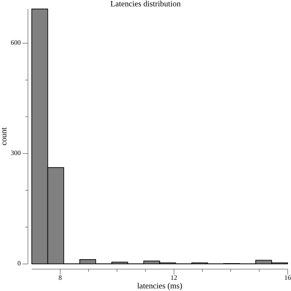
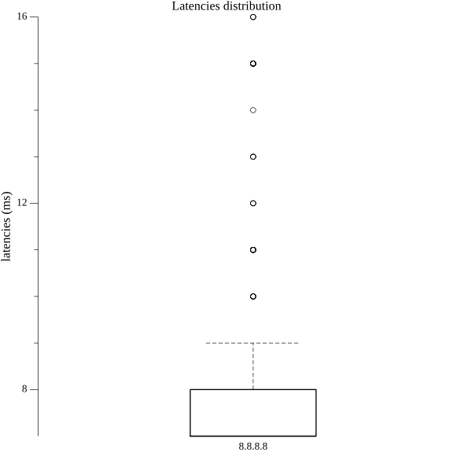
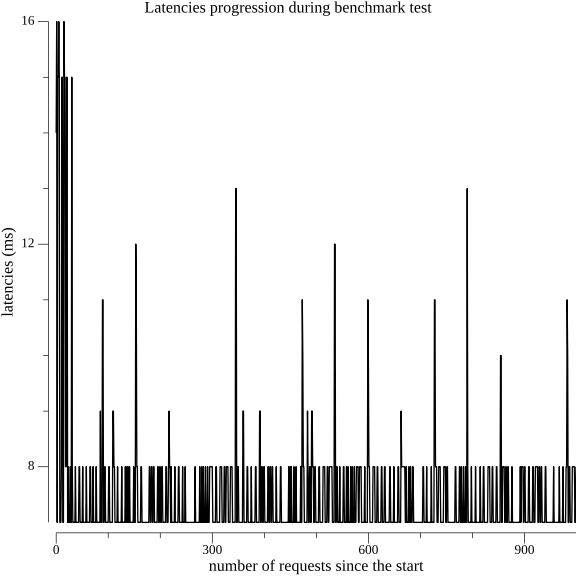
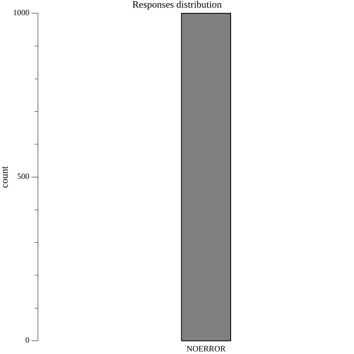
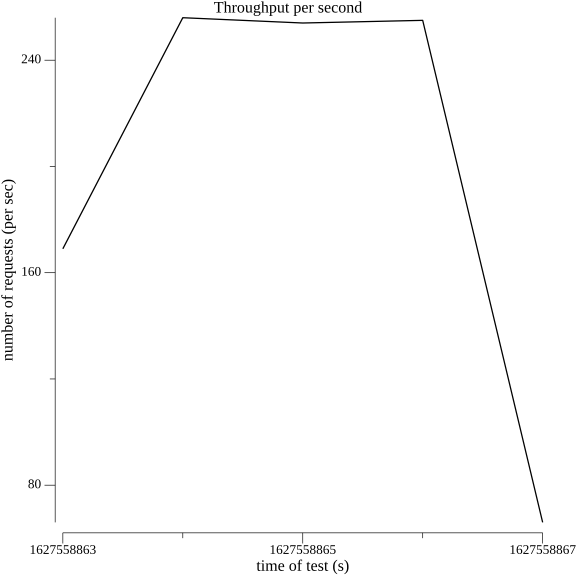

## Examples
+ [parallel benchmark with repeating queries](#parallel-benchmark-with-repeating-queries)
+ [sending AAAA DNS queries](#sending-AAAA-DNS-queries)
+ [hostnames provided directly](#multiple-hostnames-provided-directly)
+ [hostnames provided using file](#hostnames-provided-using-file)
+ [IPv6 DNS server benchmarking](#ipv6-dns-server-benchmarking)
+ [using probability to randomize concurrent queries](#using-probability-to-randomize-concurrent-queries)
+ [EDNSOPT usage](#ednsopt-usage)
+ [DoT](#dot)
+ [DoH](#doh)
  + [DoH via GET/POST](#doh-via-getpost)
  + [DoH/1.1, DoH/2](#doh11-doh2)
+ [Plotting graphs](#plotting-graphs)


### parallel benchmark with repeating queries
this example will execute the benchmark in 2 parallel threads, where each thread will
send 10 `A example.com.` DNS queries serially
```
dnstrace -n 2 -c 10 --server 8.8.8.8 --recurse example.com
```

### sending AAAA DNS queries
```
dnstrace -n 2 -c 10 --server 8.8.8.8 -t AAAA --recurse example.com
```

### multiple hostnames provided directly
hostnames provided directly as arguments to the tool
```
dnstrace -n 10 -c 10 --server 8.8.8.8 --recurse redsift.io example.com google.com
```

### hostnames provided using file
loads hostnames from given data source file
```
dnstrace -n 10 -c 10 --server 8.8.8.8 --recurse @data/2-domains
```

### sending queries of multiple different query types
this can be achieved by repeating type `-t`, all queries will be made by each specified query type
```
dnstrace -n 10 -c 10 --server 8.8.8.8 --recurse -t A -t AAAA @data/2-domains
```
together with probability option this can be used for generating arbitrary random load
```
dnstrace -n 10 -c 10 --server 8.8.8.8 --recurse -t A -t AAAA @data/2-domains --probability 0.33
```

### IPv6 DNS server benchmarking
```
dnstrace -n 10 -c 10 --server '[fddd:dddd::]:53' --recurse idnes.cz
```

### using probability to randomize concurrent queries
you can randomize queries fired by each concurrent thread by using probability lesser than 1, in this example
roughly every third hostname from datasource will be used by the single concurrent benchmark thread
```
dnstrace -c 10 --server 8.8.8.8  --recurse --probability 0.33  @data/alexa
```

### EDNSOPT usage
you can also specify EDNS option with arbitrary payload, here we are specifying EDNSOPT `65518`
coming from the local/experimental range with payload `fddddddd100000000000000000000001`
```
dnstrace -n 10 -c 10  --recurse idnes.cz --server 127.0.0.1 --ednsopt=65518:fddddddd100000000000000000000001
```
### DoT
benchmarking DoT server
```
dnstrace -n 10 -c 10  --dot --recurse  --server 1.1.1.1:853 idnes.cz
```

### DoH
benchmarking DoH server via DoH over POST method
```
dnstrace -n 200 -c 2 --server 'https://1.1.1.1/dns-query' --recurse google.com
```

#### DoH via GET/POST
you can also specify whether the DoH is done via GET or POST using `--doh-method`
```
dnstrace -c 2 --server 'https://1.1.1.1/dns-query' --doh-method get --recurse google.com
```

#### DoH/1.1, DoH/2
you can also specify whether the DoH is done over HTTP/1.1 or HTTP/2 using `--doh-protocol`
```
dnstrace -c 2 --server 'https://1.1.1.1/dns-query' --doh-protocol 2 --recurse google.com
```

### Plotting graphs
plots benchmark results as histograms, boxplots and line graphs to the current directory
```
dnstrace -n 500 -c 2 --server 8.8.8.8 --plot . --recurse google.com
```
generates graphs like these:






