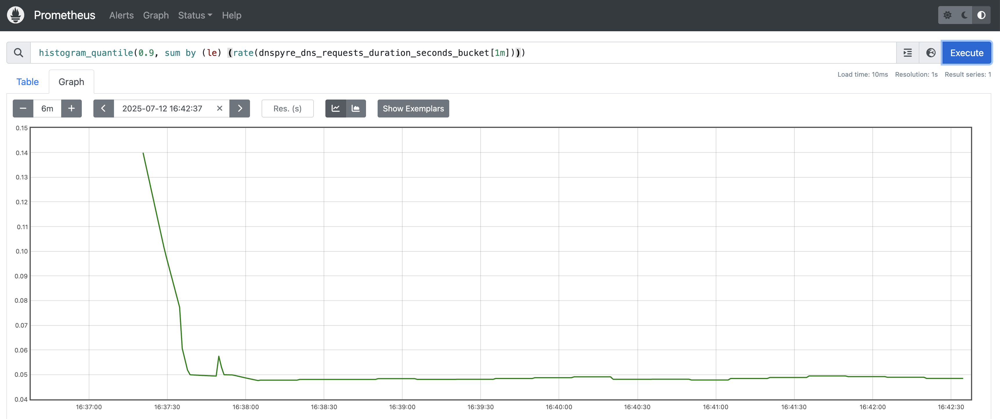
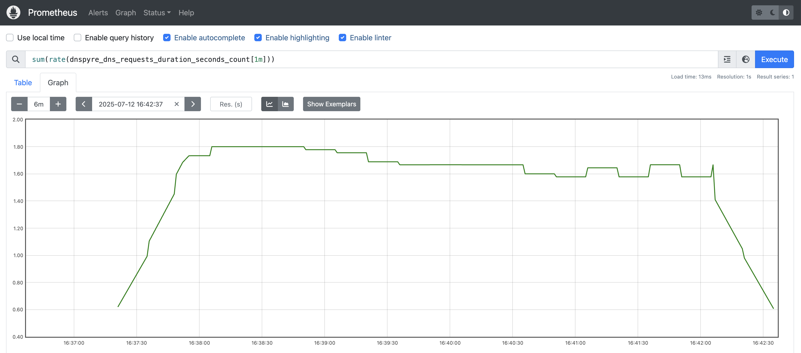
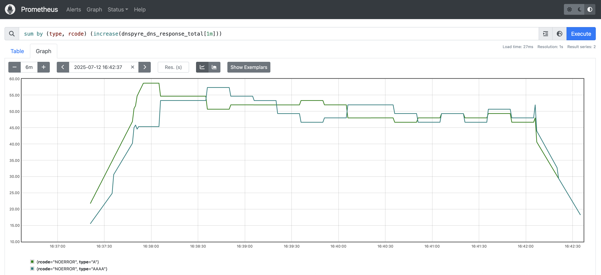

# Prometheus metrics
v3.6.0
{: .label .label-yellow }
*dnspyre* can be configured to export Prometheus metrics. This allows you to monitor the performance of *dnspyre* in real-time.
This is controlled by `--prometheus` flag. The flag accepts a `host:port` address, where the metrics will be exposed on a HTTP server.
Metrics are exposed on `/metrics` endpoint.

For example to expose Prometheus metrics on `:8080/metrics` you would specify `--prometheus ':8080'`
```
dnspyre --server 8.8.8.8 -c 10 -t A -t AAAA --duration 5m --request-delay 2s-10s --prometheus ':8080' google.com 
```

The metrics can then be scraped and queried by Prometheus:






